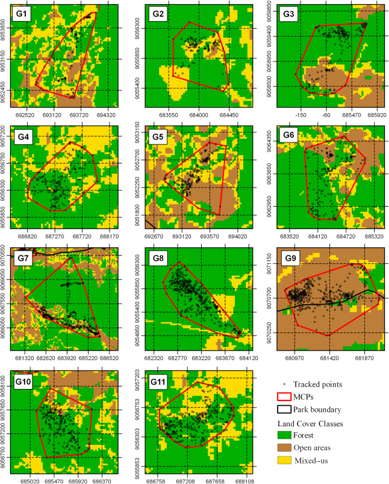
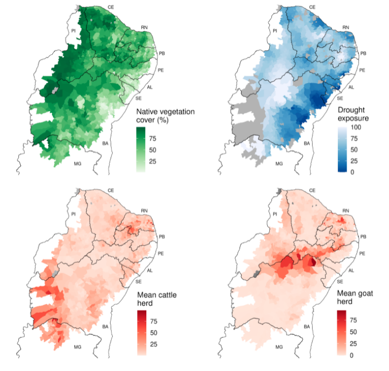

```{r xaringan-tile-view, echo=FALSE}
xaringanExtra::use_tile_view()
#xaringanExtra::use_scribble()
xaringanExtra::use_fit_screen()
```
background-position: center
background-size: cover
background-image: url("libs/caat_verde.jpg")
class: center, middle

--
background-position: center
background-size: cover
background-image: url("libs/caat_seca.jpg")
class: center, middle

--
background-position: center
background-size: cover
background-image: url("libs/caat_verde2.jpg")
class: center, middle

--
background-position: center
background-size: cover
background-image: url("libs/caat_seca2.jpg")
class: center, middle

--
background-position: center
background-size: cover
background-image: url("libs/lear.jpg")
class: center, middle

--
background-position: center
background-size: cover
background-image: url("libs/tatu2.png")
class: center, middle

--
background-position: center
background-size: cover
background-image: url("libs/vaqueiro.png")
class: center, middle

--
background-position: center
background-size: cover
background-image: url("libs/pessoas.png")
class: center, middle


--
.content-box-gray[
# A paisagem socioecológica Caatinga
]

---
.right[
# Grupos sociais vulneráveis]

.pull-left[

[Hummel 2016](Social Vulnerability to Natural Hazards in Brazil)

]

.pull-right[

]

---
background-position: center
background-size: cover
background-image: url("libs/mapbiom_caat.jpg")
class: center, middle

---
background-position: center
background-size: cover
background-image: url("libs/desmat_caat.jpg")
class: center, middle

---
.right[
# Ecologia política da restauração]

.pull-left[

##- Reconhecer os atores afetados


##- Combater desigualdades


##- Valorizar conhecimentos locais


##- Recuperar/Conservar a diversidade socioecológica
]

.pull-right[

]

---

background-position: center
background-size: cover
background-image: url("libs/roca_caat.jpg")
class: center, middle

--
.content-box-gray[
# Como criar paisagens sustentáveis na Caatinga?
]


---

# Pertubação Crônica
.center[ ]

### fuente: [Antongiovanni et al (2020)](https://besjournals.onlinelibrary.wiley.com/doi/full/10.1111/1365-2664.13686)


---
.right[
# Bodes e Caatinga]
.left[
 [Menezes et al 2020](https://onlinelibrary.wiley.com/doi/epdf/10.1002/ldr.3693)
]

---
.right[
# Bodes e Caatinga]
.pull-left[


fuente: [Jamelli et al 2021](https://www.sciencedirect.com/science/article/abs/pii/S0140196321000987)
]

.pull-right[

]

---
.right[
# Bodes e Caatinga]
.pull-left[

]

.pull-right[
### - Áreas de uso de 100ha
### - Hábito generalista
### - Reduzem biomassa de herbáceas
### - Preferência por hábitats abertos
### fuentes: [Jamelli et al 2021](https://www.sciencedirect.com/science/article/abs/pii/S0140196321000987) e [Menezes et al 2020](https://onlinelibrary.wiley.com/doi/epdf/10.1002/ldr.3693)
]

---
.left-column[
# Respostas da Vegetação ao Clima e Fertilidade
### Pinho et al 2019]

.right-column[
.center[
]
]

---
.left-column[
# Respuestas de la vegetación al disturbio
### Pinho et al 2019]

.right-column[
.center[
]
]

---
background-position: center
background-size: cover
background-image: url("libs/drone.png")
class: center, middle

--

.content-box-gray[
# cDEEP - Caatinga Dry Ecosystem Ecological Program
]


---
#Invasão Biológica vs. Comunidade de Plantas
.left-column[
# Modifica a composição taxonômica
]
.right-column[

]

---
#Invasão Biológica vs. Comunidade de Plantas
.left-column[
## Reduz Riqueza Funcional (FRic)
## Ainda sem efeitos claros para outras métricas
]
.right-column[

]

---
# Qual o estratégia funcional das espécies invasoras em comparação com as especies comuns da Caatinga?


---
background-position: center
background-size: cover
background-image: url("libs/homen_caatinga.jpg")
class: center, middle
--
.content-box-gray[
# Caatinga e bem-estar humano
]


---
background-position: center
background-size: 90%
background-image: url("libs/wef.png")

###[Melo et al. 2021](https://www.nature.com/articles/s41893-020-00608-z)

---
.right[
# Segurança Alimentar e Caatinga]
.pull-left[

]

.pull-right[
##  Caatinga + Bodes = Conservação?


Fonte: Alencar et al (2021)
]


---
.left-column[
# Segurança hídrica e Caatinga
### - Acesso à água
### - Problema multidimensional
### - Variaveis socioeconômicas
### fonte: Alencar et al 2021)
]

.right-column[

]

---
.left-column[
# Segurança energética e Caatinga
### - Importante fonte de energía
### - Extração de lenha
#### fonte: Alencar et al (2021)
]

.right-column[

]

---
.left-column[
# Segurança alimentar e Caatinga
### - Sinergias e conflitos
### - Planejamento da *restuaração*?
#### fonte: Alencar et al (em revisão)
]

.right-column[

]

---

.pull-left[

]

.pull-right[
# Restauração biocultural
### - Conhecimento tradicional
### - Aumenta a participação
### - Reproduz características originais do sistema
### fonte: [Sena et al 2021]()

]

---
.left-column[
## Floresta & Desenvolvimento
## Dinâmica de "boom-bust" 
####Alencar et al (in prep)


]
.right-column[
.center[
]]

---
.right[
# Caatinga é energía
]

.pull-left[


## 85% da energia eólica do Brasil

[Neri et al 2019](https://www.sciencedirect.com/science/article/pii/S2530064419300537)
]

.pull-right[

## Mercado de R$ 2Bi/ano
fonte: [Canal Rural](https://www.canalrural.com.br/noticias/mercado-lenha-nordeste/)
]

---
class: center, middle

.left[
[Neri et al (2019)](https://www.sciencedirect.com/science/article/pii/S2530064419300537)
]

---
# Acceso à terra e restauração

Tipo de propriedade | N  | Vegetação (Mi de ha) | Deficit (ha) | N Prop c/ Deficit
--------|---------|---------
Grandes | 21104 | 10.5	| -139644 | 2986
Pequenas | 975078 | 9.2 | -143501 | 141144
.center[
]

---
# Acceso à terra e restauração
Tipo de propriedade | N de mun  | Deficit médio (ha) | Deficit total (ha) 
--------|---------|---------
Restauração para grandes | 187 | 589 ± 877	| -110,066
Estratégia mista | 227 | 423 ± 556 | -95917
Restauração para Pequenas | 735 | 146 ± 258 | -107544
.center[
]


---
background-position: center
background-size: cover
background-image: url("libs/tatu2.png")
# El parque del Armadillo

--
.pull-left[


]

--
.pull-right[


]

---
.pull-left[

]
.pull-right[
# Mudanças climáticas
##- Evitar a política do "menos"
##- Tomar o controle de processos econômicos ligados à natureza
##- Restauração como ferramenta de transformação social


]

---

# Lições aprendidas
<br><br>

--
## - A Caatinga pode se converter num laboratório de restauração inclusiva

--
## - Monitorar indicadores socioeconômicos e ambientaiss em conjunto

--
## - Mover o foco do carbono para serviços de provisão e bem-estar humano

---
background-position: center
background-size: 60%
background-image: url("https://pbs.twimg.com/media/EI3bCfgXUAA5fHm.jpg")


---
class: center, middle

# A URSENE vai dominar o Brasil


---
# Agradecimentos:
.pull-left[
### - Dra. Adriana Pelegrinni
### - Dra. Cristina Baldauf
### - Dra. Gislene Ganade
### - Dr. Luke Parry
### - Dr. Marcelo Tabarelli
### - Dr. Severino R.R. Pinto
]
.pull-right[
```{r, echo=FALSE, out.width="120%"}
knitr::include_graphics("libs/unis.png")
```
]

---
class: center, middle

# Obrigado
## [ecoaplic.org](www.ecoaplic.org)


