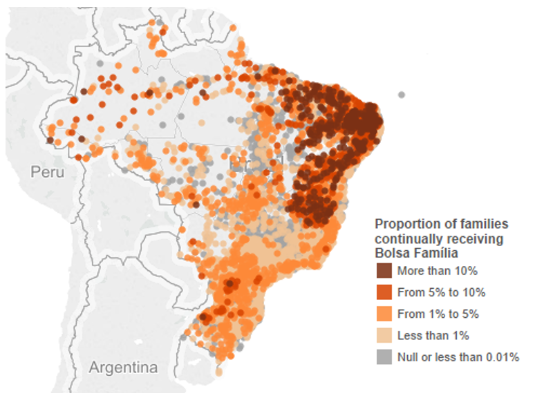
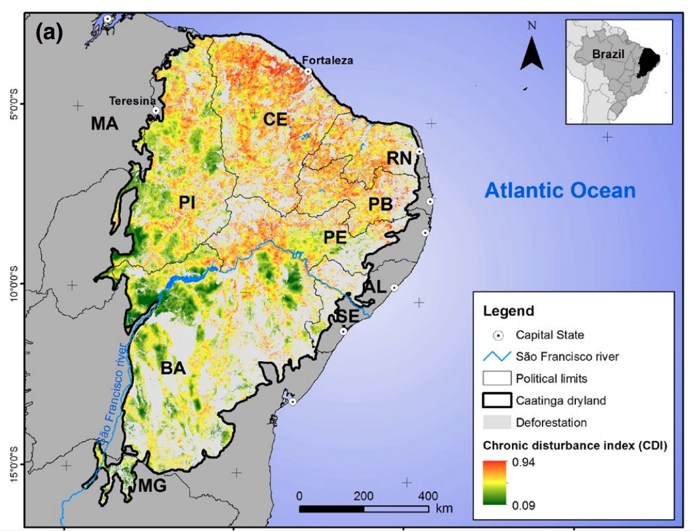
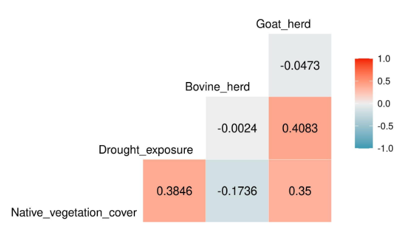

```{r xaringan-tile-view, echo=FALSE}
xaringanExtra::use_tile_view()
#xaringanExtra::use_scribble()
xaringanExtra::use_fit_screen()
```
background-position: center
background-size: cover
background-image: url("libs/caat_verde.jpg")
class: center, middle

--
background-position: center
background-size: cover
background-image: url("libs/caat_seca.jpg")
class: center, middle

--
background-position: center
background-size: cover
background-image: url("libs/caat_verde2.jpg")
class: center, middle

--
background-position: center
background-size: cover
background-image: url("libs/caat_seca2.jpg")
class: center, middle

--
background-position: center
background-size: cover
background-image: url("libs/lear.jpg")
class: center, middle

--
background-position: center
background-size: cover
background-image: url("libs/tatu2.png")
class: center, middle

--
background-position: center
background-size: cover
background-image: url("libs/vaqueiro.png")
class: center, middle

--
background-position: center
background-size: cover
background-image: url("libs/pessoas.png")
class: center, middle


--
.content-box-gray[
# El paisaje socioecológico de la Caatinga
]

---
.right[
# Las personas más vulnerables de Brasil]

.pull-left[

[Hummel 2016](Social Vulnerability to Natural Hazards in Brazil)

]

.pull-right[

]

---
background-position: center
background-size: cover
background-image: url("libs/mapbiom_caat.jpg")
class: center, middle

---
background-position: center
background-size: cover
background-image: url("libs/desmat_caat.jpg")
class: center, middle

---
.right[
# Qué es un abordaje Biocultural?]

--
##- Reconocer quienes se benefician

--
##- Atacar desigualdades de acceso a recursos

--
##- Valorar conocimientos locales

--
## - Recuperar/Conservar la diversidad socioecológica


---

background-position: center
background-size: cover
background-image: url("libs/roca_caat.jpg")
class: center, middle

--
.content-box-gray[
# Cómo crear paisajes socioecológicos sustentables en la Caatinga?
]


---

# El disturbio crónico
.center[ ]

### fuente: [Antongiovanni et al (2020)](https://besjournals.onlinelibrary.wiley.com/doi/full/10.1111/1365-2664.13686)

---
.right[
# Chivos y la Caatinga]
.pull-left[

]

.pull-right[
### - Áreas de uso de 100ha
### - Hábito generalista
### - Reducem biomasa de herbáceas
### - Preferencia por hábitats abiertos
### fuentes: [Jamelli et al 2021](https://www.sciencedirect.com/science/article/abs/pii/S0140196321000987) e [Menezes et al 2020](https://onlinelibrary.wiley.com/doi/epdf/10.1002/ldr.3693)
]

---
.right[
# Chivos y la Caatinga]
.left[
 [Menezes et al 2020](https://onlinelibrary.wiley.com/doi/epdf/10.1002/ldr.3693)
]

---
.right[
# Chivos y la Caatinga]
.pull-left[


fuente: [Jamelli et al 2021](https://www.sciencedirect.com/science/article/abs/pii/S0140196321000987)
]

.pull-right[

]

---
.left-column[
# Respuestas de la vegetación al disturbio
### Pinho et al 2019]

.right-column[
.center[
]
]

---
.left-column[
# Respuestas de la vegetación al disturbio
### Pinho et al 2019]

.right-column[
.center[
]
]

---
.left-column[
# Respuestas de la vegetación al disturbio
### Pinho et al 2019]

.right-column[
.center[
]
]

---
background-position: center
background-size: cover
background-image: url("libs/drone.png")
class: center, middle

--

.content-box-gray[
# cDEEP - Caatinga Dry Ecosystem Ecological Program
]

---
<iframe width="1080" height="715" src="libs/video.mp4" frameborder="0" allowfullscreen></iframe>

---
background-size: cover
background-image: url("libs/cdeep_result.png")
<br><br><br><br><br><br><br><br><br><br><br><br><br><br><br><br><br><br><br><br><br><br>
.right[.content-box-gray[Carmo et al (under review)]]

---
#Invasão Biológica vs. Comunidade de Plantas
.left-column[
# Modifica drasticamente a composição taxonômica
]
.right-column[

]

---
#Invasão Biológica vs. Comunidade de Plantas
.left-column[
# Reduz Diversidade Funcional (FDis)
# Reduz Regularidad Funcional (FEve)
]
.right-column[

]

---
# Qual o estratégia funcional das espécies invasoras em comparação com as especies comuns da Caatinga?


---
background-position: center
background-size: cover
background-image: url("libs/homen_caatinga.jpg")
class: center, middle
--
.content-box-gray[
# Caatinga y bienestar humano
]


---
background-position: center
background-size: 90%
background-image: url("libs/wef.png")

###[Melo et al. 2021](https://www.nature.com/articles/s41893-020-00608-z)

---
.right[
# Seguridad alimentaria y Caatinga]
.pull-left[

]

.pull-right[
##  Caatinga + Chivos = Conservación?


Fonte: Alencar et al (in press)
]


---
.left-column[
# Seguridad hídrica y Caatinga
### - Acceso al água
### - Problema multidimensional
### - Variables socioeconómicas
### fonte: Alencar et al in press)
]

.right-column[

]

---
.left-column[
# Segurança energética e Caatinga
### - Importante fuente de energía
### - Extración no oficial de leña
#### fonte: Alencar et al (in press)
]

.right-column[

]

---

.pull-left[

]

.pull-right[
# Restauración biocultural
### - Conocimiento tradicional es clave
### - Aumenta la participación
### - Reproduce características originales del sistema
### fonte: [Sena et al 2021]()

]

---
.left-column[
## Forest~Livelihoods
## Boom-and-bust development
####Alencar et al (in prep)


]
.right-column[
.center[
]]

---
.right[
# Caatinga es energía
]

.pull-left[


## 85% da energia eólica do Brasil

[Neri et al 2019](https://www.sciencedirect.com/science/article/pii/S2530064419300537)
]

.pull-right[

## Mercado de R$ 2Bi/ano
fonte: [Canal Rural](https://www.canalrural.com.br/noticias/mercado-lenha-nordeste/)
]

---
class: center, middle

.left[
[Neri et al (2019)](https://www.sciencedirect.com/science/article/pii/S2530064419300537)
]

---
background-position: center
background-size: 100%
background-image: url("libs/land_tenure.png")
# Acceso a la tierra y restauración
<br><br><br><br><br><br><br><br><br><br><br><br><br><br><br><br>
### Melo et al (under review)


---
background-position: center
background-size: cover
background-image: url("libs/tatu2.png")
# El parque del Armadillo

--
.pull-left[


]

--
.pull-right[


]

---
<iframe width="1280" height="620" src="https://www.youtube.com/embed/rQHAgyrXims" title="YouTube video player" frameborder="0" allowfullscreen></iframe>

---

# Lecciones
<br><br>

--
## - La Caatinga puede convertirse en un laboratorio de restauración/conservación  inclusiva

--
## - Monitorear indicadores socioeconómicos y ambientales es crucial

--
## - Mover el foco del carbono para servicios e personas


---
class: center, middle


---
# Agradecimentos:
.pull-left[
### - Dra. Adriana Pelegrinni
### - Dra. Cristina Baldauf
### - Dra. Gislene Ganade
### - Dr. Luke Parry
### - Dr. Marcelo Tabarelli
### - Dr. Severino R.R. Pinto
]
.pull-right[
```{r, echo=FALSE, out.width="120%"}
knitr::include_graphics("libs/unis.png")
```
]

---
background-position: center
background-size: cover
background-image: url("libs/cc_ltx.jpg")

--
background-position: center
background-size: cover
background-image: url("libs/cc_lac.png")

--
background-position: center
background-size: cover
background-image: url("libs/cc_pant.jpg")

--
background-position: center
background-size: cover
background-image: url("libs/cc_manaus.png")


---
class: center, middle

# Gracias
## [ecoaplic.org](www.ecoaplic.org)


