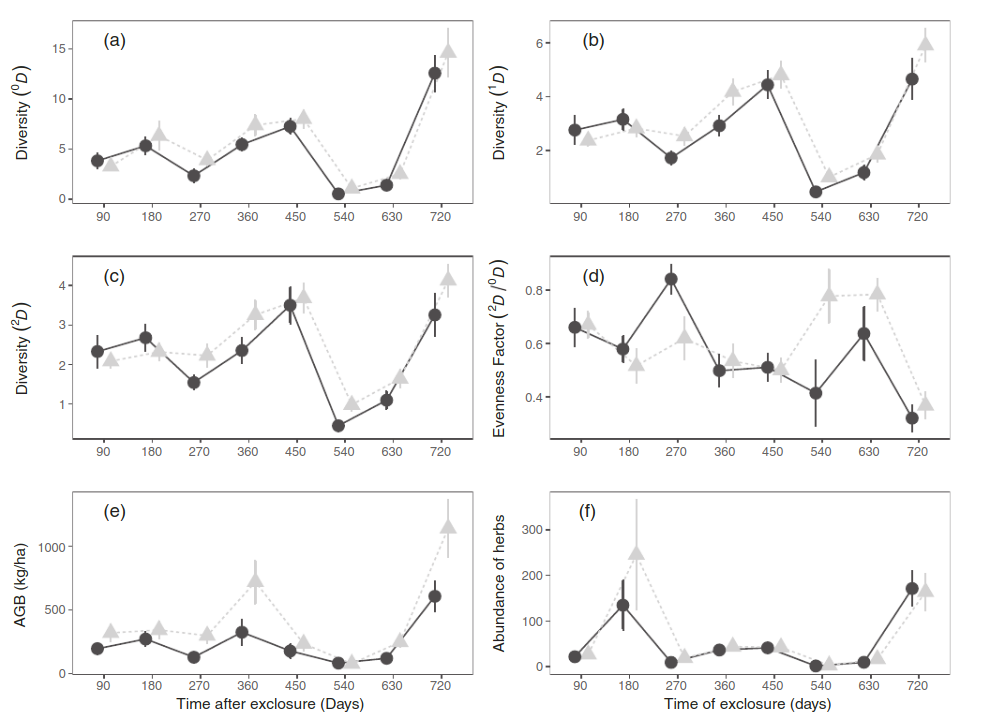
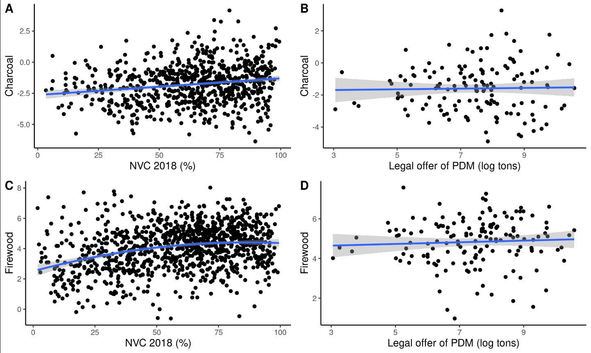

```{r xaringan-themer, include=FALSE, warning=FALSE}

xaringanExtra::use_scribble()
library(xaringanthemer)
style_mono_accent(
  base_color = "#1c5253",
  header_font_google = google_font("Josefin Sans"),
  text_font_google   = google_font("Montserrat", "300", "300i"),
  code_font_google   = google_font("Fira Mono")
)

xaringanthemer::style_xaringan(colors = c(
  red = "#f34213",
  purple = "#3e2f5b",
  orange = "#ff8811",
  green = "#136f63",
  white = "#FFFFFF"))
```

background-image: url(https://www.fao.org/fileadmin/user_upload/zhc/img/ZHCIndigenouspeoples-620x338.jpg)
background-size: cover
class: center, middle

--
.content-box-grey[
#¿Qué neceistamos saber hoy?
]

---
.pull-left[
### -La importancia del conocimeinto tradicional para la restauración

### -Etnobotánica y otras ciencias multidisciplinares

### -La importancia del conocimiento tradicional

]

--

.pull-right[

]

---
.left-column[
## Plantas medicinales
### Servicio de provisión
]

.right-column[


[Wikipedia](https://en.wikipedia.org/wiki/Medicinal_plants)
]

---
# Altísimo valor
.pull-left[
### [US$ 5 trilhões](https://india.mongabay.com/2020/02/forests-that-heal-medicinal-plants-as-an-ecosystem-service/)
### 4 mil millones de personas


]

.pull-right[
### La Cannabis medicinal vale [US$ 9 Bilhões](https://www.grandviewresearch.com/industry-analysis/legal-marijuana-market)
### Crescimento de até 90 Bilhões até 2026


]

---
.left-column[
# Etnobotánica 

## Aleimentación
## Cultural
## Farmacológico

]
.right-column[
.center[

]]

---
# [Etnofarmacologia](https://pt.wikipedia.org/wiki/Etnofarmacologia)
.pull-left[
### - 25% de las drogas son de origen vegetal
### - Expediciones etnobotánicas
### - Historicamente importante
### - Problemas con la propriedad intelectual
]
.pull-right[

]

---
# El conocimiento tradicional

.left-column[
### Resiliencia a cambios climáticos
### Soberania de los pueblos tradicionales
]

.right-column[


[Camara-leret et al (2019)](https://www.pnas.org/content/116/20/9913)
]

---
# El conocimiento tradicional

.left-column[
###  Resiliencia a cambios climáticos
###  Soberania de los pueblos tradicionales
###  Conocimiento médico
]

.right-column[


[Camara-leret & Bascompte (2021)](https://www.pnas.org/content/118/24/e2103683118.short)
]

---
# Benefícios psicológicos
.left-column[
### Interacciones plantas-pessoas
### Bienestar general
### Terapias con horticultura
]

.right-column[


[Del Sesto (2020)](https://nph.onlinelibrary.wiley.com/doi/full/10.1002/ppp3.10087)
]

---
# Soberania alimentaria
.left-column[
### Acaí
### Quinoa
### Chia
### Chás diversos
### [Acaí = US$ 17 Milhões em exportações](https://g1.globo.com/pa/para/noticia/2019/02/21/caminhos-do-acai-estados-unidos-consome-40-da-exportacao-paraense-mercado-na-europa-e-timido-e-fruto-movimenta-us-17-milhoes-em-dois-anos.ghtml)
]

.right-column[

]

---
# Huertos medicinales
.pull-left[
### Preserva saberes tradicionales
### Valoriza medicina preventiva
### Promueve soberania
]

.pull-right[

]

---
# [Fitoteraía no SUS](https://www.conasems.org.br/wp-content/uploads/2016/05/images_FITOTERAPIA.png)
.pull-left[
### - Preserva saberes tradicioinais
### - Valoriza medicina preventiva
### - Promueve soberania
### - Pesquisa en tecnolgia
### - Novas patentes
]

.pull-right[

]

---
background-image:url(https://www.decibeldesigns.com/product_images/uploaded_images/sunstainable-forest-management.png)
background-size: cover
class:center, middle

.content-box-grey[
#Manejo forestal
]

---
# Manejo Floretal comercial
.pull-left[
### Bosques Naturales

<iframe width="1177" height="662" src="https://www.youtube.com/embed/hJo3S8RQrng" title="Manejo Florestal Sustentável - madeira nativa de Mato Grosso" frameborder="0" allow="accelerometer; autoplay; clipboard-write; encrypted-media; gyroscope; picture-in-picture" allowfullscreen></iframe>

]

.pull-right[
### Bosques Sembrados 

<iframe width="902" height="662" src="https://www.youtube.com/embed/pZo4h3OSljA" title="Curso Cultivo de Eucalipto em Pequenas Propriedades - Cursos CPT" frameborder="0" allow="accelerometer; autoplay; clipboard-write; encrypted-media; gyroscope; picture-in-picture" allowfullscreen></iframe>

]

---
# El manejo forestal en las economias
.pull-left[
### Muy pequena 
### < 3% do PIB
### 7 mi de empregos
### 10% das exportações
]
.pull-right[
##[Industria Brasileira de Árvores](https://files.cercomp.ufg.br/weby/up/986/o/relatorio-iba-2020.pdf)


]

---
.left-column[
#Manejo florestal para energia
]
.right-column[
## [Leña en la Caatinga](https://www.florestal.gov.br/ultimas-noticias/1995-mercado-de-lenha-no-nordeste-movimenta-r-2-bilhoes-por-ano-e-garante-ocupacao-equivalente-a-35-mil-postos-de-trabalho)


]

---
.left-column[
## Bosques energéticos
]

.right-column[
<iframe width="900" height="562" src="https://www.youtube.com/embed/yzc5pFjxIUs" title="Entenda como funciona o reaproveitamento da madeira da caatinga" frameborder="0" allow="accelerometer; autoplay; clipboard-write; encrypted-media; gyroscope; picture-in-picture" allowfullscreen></iframe>
]

---
.pull-left[
# [Manejo florestal comunitário](https://imazon.org.br/guia-para-o-manejo-florestal-comunitario/)

## Um grand reto
## Cadenas produtivas de la sociobiodiversidad
## Servicios ecosistemicos
]
.pull-right[
<iframe width="1177" height="662" src="https://www.youtube.com/embed/JmguQpIzwvg" title="Especial: Radiografía del manejo forestal comunitario en México" frameborder="0" allow="accelerometer; autoplay; clipboard-write; encrypted-media; gyroscope; picture-in-picture" allowfullscreen></iframe>
]

---
.left-column[
## Manejo agroecológico

### Produção de alimento
### Economia Floresal
### ¿Es posible? [SÍ](https://issuu.com/canoadocs/docs/restaura____oecol__gicasistemasagro)
]
.right-column[
.center[

]
]

---
background-image:url(https://www.bioversityinternational.org/fileadmin/_processed_/1/8/csm_DryingGarcinia_Field_India__710x590_a34c3f743f.gif)
background-size: cover
class: middle , center

.content-box-grey[
# Productos no maderables
]

---
.left-column[
## Productos no-maderables
### Estratégia de desarrollo sostenible?
]

.right-column[


[Comunidades Tradicionais: Extrativistas / Seringueiros](http://www.ecobrasil.provisorio.ws/30-restrito/categoria-conceitos/1103-comunidades-tradicionais-extrativistas-seringueiros)
]

---

.pull-left[
# [Chico Mendes](https://pt.wikipedia.org/wiki/Chico_Mendes)


]

.pull-right[
### Gran contribución para las nociones modernas de extractivismo
### Pueblos del Bosque


]

---
.left-column[
## Reservas Extrativistas 

### Rio Formoso-PE, Brasil
### Modos de vida?
### Herencia cultural?

]
.right-column[
.center[

]]

---
.left-column[
## Reservas Extrativistas 

### Comunidades costeñas
### Modos de vida?
### Herencia cultural?

]
.right-column[
.center[
<iframe width="896" height="672" src="https://www.youtube.com/embed/dduvN5_bMvw" title="YouTube video player" frameborder="0" allow="accelerometer; autoplay; clipboard-write; encrypted-media; gyroscope; picture-in-picture" allowfullscreen></iframe>
]]

---
background-position: center
background-size: cover
background-image: url("libs/caat_verde.jpg")
class: center, middle

--
background-position: center
background-size: cover
background-image: url("libs/caat_seca.jpg")
class: center, middle

--
background-position: center
background-size: cover
background-image: url("libs/caat_verde2.jpg")
class: center, middle

--
background-position: center
background-size: cover
background-image: url("libs/caat_seca2.jpg")
class: center, middle

--
background-position: center
background-size: cover
background-image: url("libs/lear.jpg")
class: center, middle

--
background-position: center
background-size: cover
background-image: url("libs/tatu2.png")
class: center, middle

--
background-position: center
background-size: cover
background-image: url("libs/vaqueiro.png")
class: center, middle

--
background-position: center
background-size: cover
background-image: url("libs/pessoas.png")
class: center, middle


--
.content-box-gray[
# El paisaje socioecológico de la Caatinga
]

---
.right[
# Las personas más vulnerables de Brasil]

.pull-left[

[Hummel 2016](Social Vulnerability to Natural Hazards in Brazil)

]

.pull-right[

]

---
background-position: center
background-size: cover
background-image: url("libs/mapbiom_caat.jpg")
class: center, middle

---
background-position: center
background-size: cover
background-image: url("libs/desmat_caat.jpg")
class: center, middle

---
.right[
# Qué es un abordaje Biocultural?]

--
##- Reconocer quienes se benefician

--
##- Atacar desigualdades de acceso a recursos

--
##- Valorar conocimientos locales

--
## - Recuperar/Conservar la diversidad socioecológica


---

background-position: center
background-size: cover
background-image: url("libs/roca_caat.jpg")
class: center, middle

--
.content-box-gray[
# Cómo crear paisajes socioecológicos sustentables en la Caatinga?
]


---

# El disturbio crónico
.center[ ]

### fuente: [Antongiovanni et al (2020)](https://besjournals.onlinelibrary.wiley.com/doi/full/10.1111/1365-2664.13686)

---
.right[
# Chivos y la Caatinga]
.pull-left[

]

.pull-right[
### - Áreas de uso de 100ha
### - Hábito generalista
### - Reducem biomasa de herbáceas
### - Preferencia por hábitats abiertos
### fuentes: [Jamelli et al 2021](https://www.sciencedirect.com/science/article/abs/pii/S0140196321000987) e [Menezes et al 2020](https://onlinelibrary.wiley.com/doi/epdf/10.1002/ldr.3693)
]

---
.right[
# Chivos y la Caatinga]
.left[
 [Menezes et al 2020](https://onlinelibrary.wiley.com/doi/epdf/10.1002/ldr.3693)
]

---
.right[
# Chivos y la Caatinga]
.pull-left[


fuente: [Jamelli et al 2021](https://www.sciencedirect.com/science/article/abs/pii/S0140196321000987)
]

.pull-right[

]

---
.left-column[
# Respuestas de la vegetación al disturbio
### Pinho et al 2019]

.right-column[
.center[
]
]

---
.left-column[
# Respuestas de la vegetación al disturbio
### Pinho et al 2019]

.right-column[
.center[
]
]

---
.left-column[
# Respuestas de la vegetación al disturbio
### Pinho et al 2019]

.right-column[
.center[
]
]

---
background-position: center
background-size: cover
background-image: url("libs/drone.png")
class: center, middle

--

.content-box-gray[
# cDEEP - Caatinga Dry Ecosystem Ecological Program
]

---
background-size: cover
background-image: url("libs/cdeep_result.png")
<br><br><br><br><br><br><br><br><br><br><br><br><br><br><br><br><br><br><br><br><br><br>
.right[.content-box-gray[Carmo et al (under review)]]

---
background-position: center
background-size: cover
background-image: url("libs/homen_caatinga.jpg")
class: center, middle
--
.content-box-gray[
# Caatinga y bienestar humano
]


---
background-position: center
background-size: 90%
background-image: url("libs/wef.png")

###[Melo et al. 2021](https://www.nature.com/articles/s41893-020-00608-z)

---
.right[
# Seguridad alimentaria y Caatinga]
.pull-left[

]

.pull-right[
##  Caatinga + Chivos = Conservación?


Fonte: Alencar et al (in press)
]


---
.left-column[
# Seguridad hídrica y Caatinga
### - Acceso al água
### - Problema multidimensional
### - Variables socioeconómicas
### fonte: Alencar et al in press)
]

.right-column[

]

---
.left-column[
# Segurança energética e Caatinga
### - Importante fuente de energía
### - Extración no oficial de leña
#### fonte: Alencar et al (in press)
]

.right-column[

]

---

.pull-left[

]

.pull-right[
# Restauración biocultural
### - Conocimiento tradicional es clave
### - Aumenta la participación
### - Reproduce características originales del sistema
### fonte: [Sena et al 2021]()

]

---
.left-column[
## Forest~Livelihoods
## Boom-and-bust development
####Alencar et al (in prep)


]
.right-column[
.center[
]]

---
.right[
# Caatinga es energía
]

.pull-left[


## 85% da energia eólica do Brasil

[Neri et al 2019](https://www.sciencedirect.com/science/article/pii/S2530064419300537)
]

.pull-right[

## Mercado de R$ 2Bi/ano
fonte: [Canal Rural](https://www.canalrural.com.br/noticias/mercado-lenha-nordeste/)
]

---
class: center, middle

.left[
[Neri et al (2019)](https://www.sciencedirect.com/science/article/pii/S2530064419300537)
]

---
background-position: center
background-size: 100%
background-image: url("libs/land_tenure.png")
# Acceso a la tierra y restauración
<br><br><br><br><br><br><br><br><br><br><br><br><br><br><br><br>
### Melo et al (under review)


---
background-position: center
background-size: cover
background-image: url("libs/tatu2.png")
# El parque del Armadillo

--
.pull-left[


]

--
.pull-right[


]

---
<iframe width="1280" height="620" src="https://www.youtube.com/embed/rQHAgyrXims" title="YouTube video player" frameborder="0" allow="accelerometer; autoplay; clipboard-write; encrypted-media; gyroscope; picture-in-picture" allowfullscreen></iframe>

---

# Lecciones
<br><br>

--
## - La Caatinga puede convertirse en un laboratorio de restauración/conservación inclusiva

--
## - Monitorear indicadores socioeconómicos y ambientales es crucial

--
## - Mover el foco del carbono para servicios e personas


---
# Agradecimentos:
.pull-left[
### - Dra. Adriana Pelegrinni
### - Dra. Cristina Baldauf
### - Dra. Gislene Ganade
### - Dr. Luke Parry
### - Dr. Marcelo Tabarelli
### - Dr. Severino R.R. Pinto
]
.pull-right[
```{r, echo=FALSE, out.width="120%"}
knitr::include_graphics("libs/unis.png")
```
]

---
class: center, middle

# Gracias
## [ecoaplic.org](www.ecoaplic.org)
