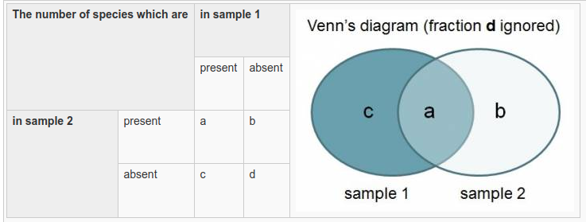
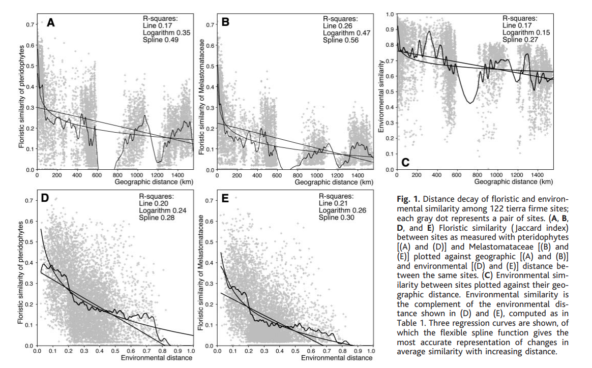

```{r setup, include=FALSE}
library(tidyverse)
library(knitr)
knitr::opts_chunk$set(echo = TRUE)
load("/home/felipe/Google Drive/github/eco_numerica/data/NEwR-2ed_code_data/NEwR2-Data/Doubs.RData")
```

```{r xaringan-tile-view, echo=FALSE}
xaringanExtra::use_tile_view()
xaringanExtra::use_share_again()
xaringanExtra::use_scribble()
xaringanExtra::use_fit_screen()
```

# Similaridade ecológica

Hoje precisamos aprender a explicar isso


---
# O que é similaridade ecológica?
.pull-left[
- A definição ecológica é simples: Quão parecidas são espécies/comunidades/indivíduos

- A definição matemática
   X = Y, então similaridade = 1
   X ≠ Y, então similaridade = 0
   
- Portanto, similaridade é quando dois objetos são iguais
]
.pull-right[


]

--
# Mas como medir essa similaridade?
---
.pull-left[
# Indices de similaridade

- Variam de 0-1
 - Dados qualitativos 
 - Dados quantitativos
- Ignoram **duplos zeros** (vamos abordar isso)


]
--

.pull-right[
# Medidas de distância

- Variam de 0 a INF
- Simétricas (consideram **duplos zeros**) 
- Assimétricas (ignoram os **duplos zeros**)
- Há dezenas delas...


]
---
# O problema dos **duplos zeros**
- Quando uma espécies X está ausete de duas amostras elas:
   - são similares? ou são diferentes?
--
   


fig by [David Zelený](https://www.davidzeleny.net/anadat-r/doku.php/en:similarity)

---
# Como funcionam os índices?



fig by [David Zelený](https://www.davidzeleny.net/anadat-r/doku.php/en:similarity)


---
class: center
# Como funionam as medidas de distância?

.pull-left[fig by [David Zelený](https://www.davidzeleny.net/anadat-r/doku.php/en:similarity)]
---
# Algumas aplicações
```{r, include=FALSE}
xaringanExtra::use_panelset()
```
.panelset[
.panel[.panel-name[R Code]

```{r}
dist(spe[1:5,1:5], method = "euclidian")
```
]

.panel[.panel-name[Plot]
```{r, echo=FALSE}
plot(hclust(dist(spe, method = "euclidian")))
```

]
]
---
# Exemplos da literatura
The role of spatial and environmental variables in shaping aquatic insect assemblages in two protected areas in the transition area between Cerrado and Amazônia _Biota Neotrop. vol.20 no.3 Campinas  2020  Epub June 24, 2020_
http://dx.doi.org/10.1590/1676-0611-bn-2019-0923
.center[

]

---
# Exemplos da literatura


[Tumisto et al (2003)](https://is.muni.cz/el/1431/jaro2014/Bi0662/um/47273497/_Tuomisto_etal_2003_Science_floristic-variation_Amazonian-forests.pdf)

---
# Exemplos da literatura


- Similaridade se deve à:
   - Troca de espécies entre comuniades
   - Subamostras de espécies
   - Ambos processos
---
class: center, middle
# FIM
